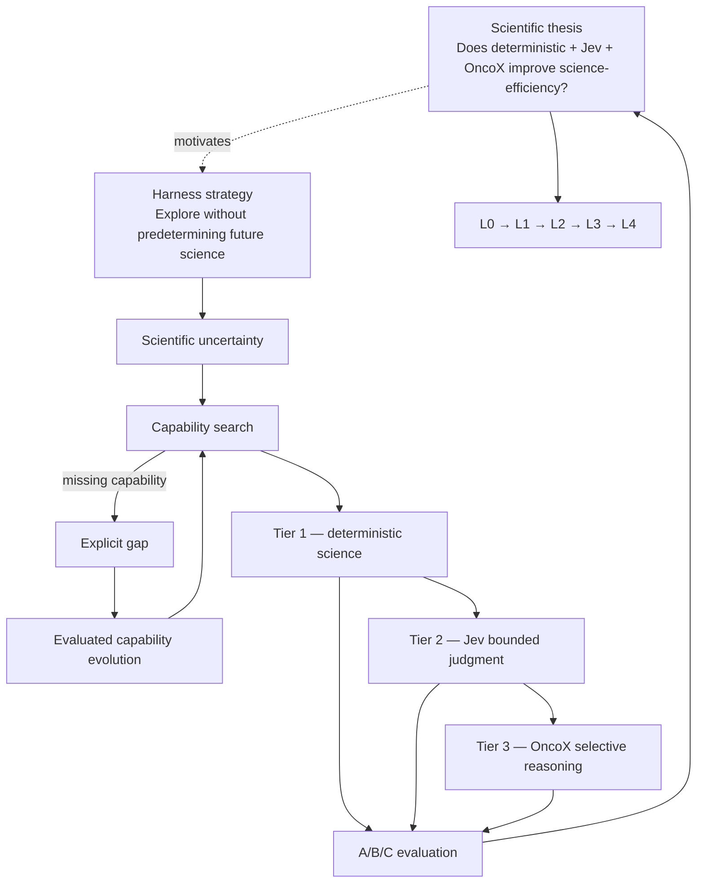
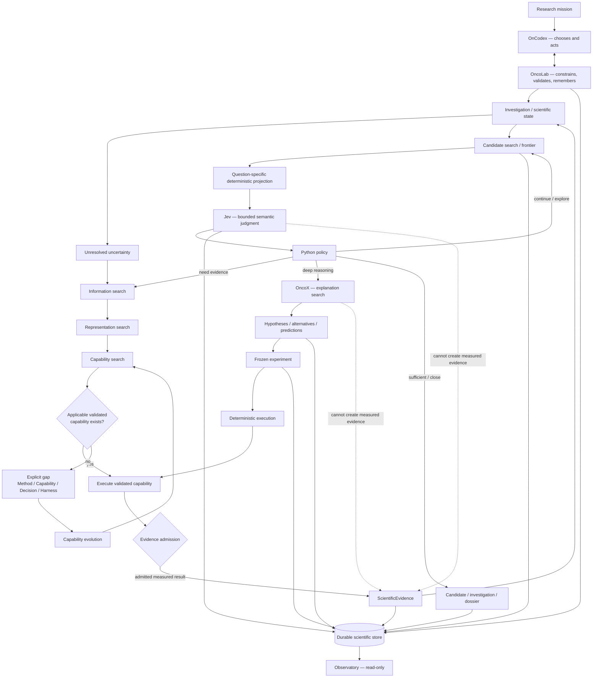

# Architecture

## Principle

Keep epistemic rules stable; let capabilities evolve.

## Repository mental model

OncoJev is the whole system. The **scientific thesis** and the **harness strategy** are distinct
layers: the thesis asks whether deterministic science + bounded Jev judgment + selective OncoX
reasoning improve scientifically useful discovery per unit resource; the harness strategy keeps
the system able to explore without predefining future science.



Capability evolution is the mechanism that allows the system to pursue the thesis without
assuming in advance what scientific tools future investigations will require.

## Adaptive scientific search

OncoJev is an adaptive scientific search system, not a fixed pipeline. At each step an
investigation decides what to do next from scientific state. Supported decisions include:

```text
expand
narrow
replicate
branch
acquire information
change representation
investigate deeper
defer
backtrack
stop
```

No investigation must traverse the same sequence, and no modality order is fixed. Measurement
classes enter through capabilities, not through permanent orchestration lanes.

## Five search problems

1. **Information search** — what evidence or information should be acquired next?
2. **Representation search** — what is the cheapest scientifically sufficient representation for
   the next decision?
3. **Capability search** — what validated capability can obtain, measure, transform, or judge the
   required information?
4. **Candidate search** — which scientific states deserve deeper investigation?
5. **Explanation search** — what explanation accounts for the evidence, and what observation
   would distinguish alternatives?

Capability search is first-class and distinct from candidate search. When it finds no applicable
capability, that is an explicit gap, and capability evolution begins. Capability evolution is
harness infrastructure around the three tiers — not a fourth intelligence tier.

## Runtime roles

### OnCodex

Top autonomous research agent and evolving harness built around the OpenAI Agents SDK. It decides what to work on, invokes tools/capabilities, adapts, branches, backtracks, and runs architecture or scientific experiments.

Its responsibilities are state-driven, not stage-driven: inspect the scientific state; identify
unresolved uncertainty; choose what to investigate next; search capabilities; progressively load
capability contracts; verify applicability; invoke allowed capabilities; expose explicit gaps;
request richer representations; manage frontier/search decisions; request bounded Jev judgments
where useful; invoke OncoX selectively; propose experiments; branch, backtrack, defer, and stop.
The next action may depend on scientific state rather than a static stage number.

OnCodex must not become a giant hardcoded pipeline coordinator.

The experimental Agents SDK `codex_tool` is an optional workspace/coding capability behind a
narrow adapter. It is not a domain dependency. Codex sits on the engineering side: bounded
specification -> small implementation -> verification -> candidate capability -> evaluated
registration. Codex cannot alter scientific questions, frozen experiments, or populations; cannot
replace deterministic statistics with reasoning; cannot reinterpret failed results until they
pass; cannot create ScientificEvidence; and cannot self-promote generated capabilities.

### OncoLab

Durable laboratory substrate. It owns or governs experiment identity, operation identity, the
capability registry, engineering readiness, scientific readiness, budgets, legality, evidence
admission, gap state, activation constraints, recovery, and durable history.

OnCodex chooses and acts. OncoLab constrains, validates, and remembers.

Historical scientific state is immutable: OnCodex cannot rewrite it, and a material post-result
change creates a new experiment identity rather than an edit.

### Discovery

Search subsystem. Owns frontiers, branches, candidate states, exploration reasons, reranking/search policies, and search history. It does not manufacture ScientificEvidence or mechanisms.

### Execution

Deterministic acquisition and measurement boundary. It may return measured results; OncoLab decides whether those results satisfy admission requirements to become ScientificEvidence.

Sources are adapters, not architecture: external response -> source-specific parser -> typed
acquisition record -> scientific capability -> typed scientific result -> ScientificEvidence.
GDC/GDAN or future sources must not become generic scientific architecture (`GDCScience`,
`TCGAScience`, `GDANScience` layering is forbidden); source-specific details terminate at
adapters, and the core stays source and modality agnostic.

### Jev

Shared typed semantic infrastructure. The shared layer owns invocation and primitive/result mechanics; domains own question semantics, projections, applicability, thresholds, and policy.

### OncoX

Selective deep scientific reasoner. It may create interpretations, hypotheses, alternatives, predictions, and proposed discriminating experiments. It may not create measured evidence.

### Store

Generic persistence only. It must not contain scientific decision policy.

### Observatory

Read-only projection over durable state.

## Epistemic direction

```text
source data
  -> deterministic measurement
  -> ScientificEvidence
  -> deterministic semantic projection
  -> JevDecision
  -> policy / frontier
  -> selective OncoX reasoning
  -> hypothesis / proposed experiment
  -> frozen experiment
  -> deterministic execution
  -> new ScientificEvidence
```

## Canonical adaptive flow



OnCodex chooses and acts. OncoLab constrains, validates, and remembers. Execution measures. Jev
judges. Python decides. OncoX explains and hypothesizes. Store persists. Observatory reads.

Implementation status (2026-09-30): the deterministic nucleus (evidence admission, investigation
revisions, investigation/evidence ledgers), deterministic capability search, the gap ledger, and a
session-independent research step are implemented and experimentally exercised (A021-A025, S002;
see `docs/tasks/README.md`). Evidence admission is wired. Agent-side Jev/OncoX invocation,
automated capability evolution, and typed capability output contracts remain target contracts; the
capability search is an initial evaluated mechanism, not established retrieval architecture.

## Experiment classes

Only two:

- `ARCHITECTURE`: tests OncoJev itself and may justify architecture changes.
- `SCIENTIFIC`: tests biological/scientific hypotheses and may update research evidence.

No third "harness experiment" class.

## Dependency intent

Core scientific data types should sit low in the graph. External SDKs are leaf adapters.

Allowed conceptual direction:

```text
evidence <- execution
   ^          ^
   |          |
   +------ oncolab
             ^
             |
          oncodex

jev contracts <- domain-owned projections
oncox ports   <- oncodex orchestration
store         <- generic serialized events only
```

Mechanical checks intentionally forbid obvious inverse dependencies such as `evidence -> oncodex`, `execution -> oncox`, or `store -> discovery`.

## Capability evolution

```text
Need
 -> classify gap
 -> MethodGap | CapabilityGap | DecisionGap | HarnessGap
 -> appropriate research/development path
 -> evaluation
 -> versioned promotion
 -> bounded activation
```

Dynamic composition of existing capabilities is routine. Creating a new capability is a governed lifecycle. See `docs/CAPABILITY_EVOLUTION.md`.

## What is intentionally absent

- source-specific core types;
- full data pipelines;
- permanent Wide/Deep Jev batteries;
- autonomous code self-promotion;
- RL;
- a generic `harness/` package;
- a nested `oncojev/oncojev/` package topology;
- a production UI.
