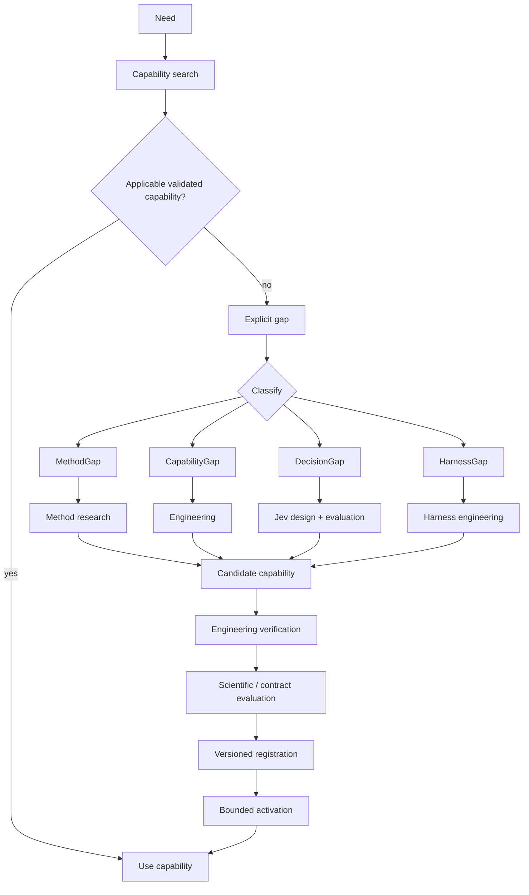

# Capability evolution

A mature autonomous laboratory cannot know every future method, source, semantic distinction, execution tool, or runtime capability. It therefore needs capability evolution without uncontrolled self-modification.

## Dynamic composition versus evolution

**Dynamic composition:** OnCodex selects from capabilities that already exist and are valid for the current state.

**Capability evolution:** the required ability does not exist. A gap must be classified, developed through the correct route, evaluated, versioned, promoted, and only then activated within its validated scope.

## Gap taxonomy

### MethodGap

The lab does not know a scientifically defensible method.

Route: methodological/scientific research -> candidate method -> method evaluation -> scientifically defensible method; if code is absent, the request becomes a `CapabilityGap`.

A MethodGap is never routed directly to Codex implementation, and a coding agent may not invent a method and label the problem solved.

### CapabilityGap

A defensible method is known, but the executable implementation is absent.

Route: bounded engineering specification -> Codex/engineering capability -> implementation -> focused tests -> architecture checks -> verification -> scientific evaluation where scientifically consequential -> versioned capability.

### DecisionGap

A bounded semantic distinction is useful, but no evaluated Jev capability exists.

Route: bounded semantic question -> deterministic projection -> candidate Jev capability -> development evaluation -> validation -> locked evaluation -> bounded activation.

Questions emerge from a real decision gap; there are no permanent global Jev batteries, and model confidence is not permission.

### HarnessGap

The runtime lacks an operational ability required to run safely/reliably.

Route: bounded harness engineering -> verification -> versioned engineering capability.

Harness work improves runtime reliability; it must not silently mutate scientific methods or evidence rules.

## Promotion

Engineering promotion is explicit:

```text
gap
 -> engineering task
 -> isolated worktree when code change is material
 -> implementation
 -> focused tests
 -> architecture checks
 -> full verification
 -> real Git commit/tree identity
 -> PromotionRecord
 -> activation
```

Do not fabricate a synthetic version identifier when Git can provide the actual source identity.

## Lifecycle



Preserve unconditionally:

```text
generated != verified
engineering verified != scientifically validated
scientifically validated != universally applicable
```

## Two readiness axes

Engineering readiness asks whether the implementation is reproducible, tested, typed/validated at boundaries, and structurally legal.

Scientific readiness asks whether the capability is defensible for a defined scientific use, population, data distribution, assumptions, and evidence level.

A capability can be engineering-PROMOTED and scientifically-EXPERIMENTAL.

## Jev capabilities as semantic instruments

A consequential Jev capability should eventually carry:

- identity/version/domain owner;
- semantic purpose;
- required projection/version;
- primitive and bounded question contract;
- applicability/prerequisites/exclusions;
- model compatibility;
- raw-result schema;
- downstream policy interface;
- evaluation/calibration/stability/OOD records;
- engineering and scientific readiness.

Do not say simply "this Jev question is validated." State the contract, projection, model, domain/state distribution, and decision consequence for which it was evaluated.

## Autoresearch is offline capability research

The TypeSafe autoresearch pattern is potentially useful for `DecisionGap` resolution: propose questions, featurize cases with Jev, evaluate against development outcomes, use errors to revise, then validate on untouched cases.

It must not become:

```text
production observation -> invent question -> immediately use question in production
```
